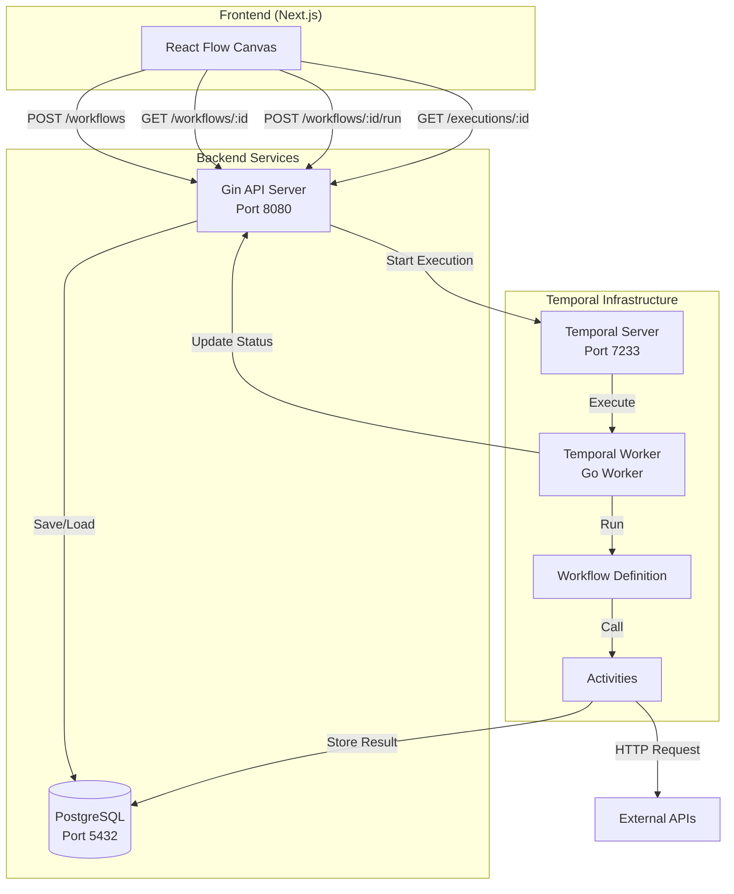
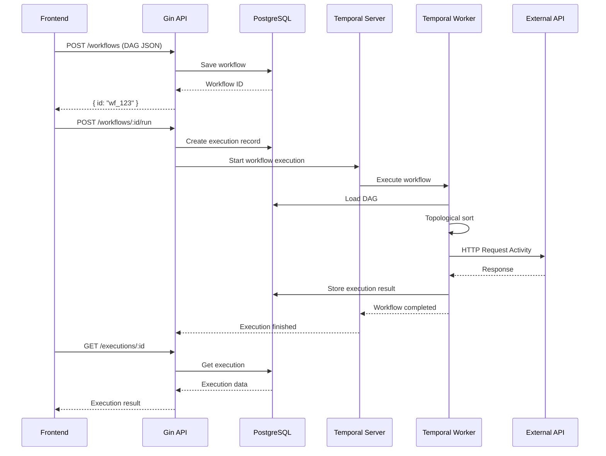
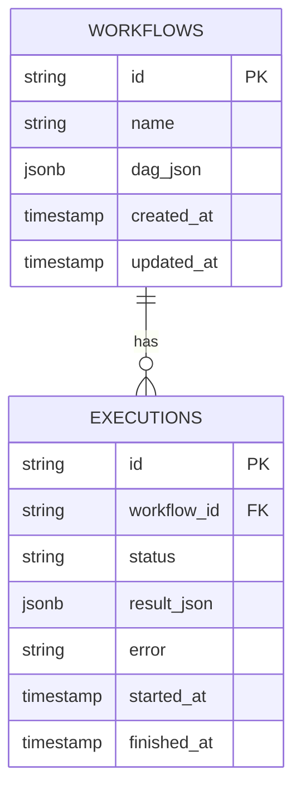

# Backend Prompt Document (Go Gin + Temporal + Postgres)

## Overview
สร้าง backend สำหรับ n8n-clone POC โดยใช้ **Go (Gin)** สำหรับ REST API, **Temporal** สำหรับ workflow execution, และ **PostgreSQL** สำหรับเก็บข้อมูล workflow และ execution results.

---

## 1. Infrastructure Project Setup

### Prerequisites
- Go 1.22+
- Docker + Docker Compose
- PostgreSQL client tools (optional)

### Project Structure
```
backend/
├── cmd/
│   ├── api/          # Gin API server entry point
│   └── worker/       # Temporal worker entry point
├── internal/
│   ├── api/          # API handlers (Gin routes)
│   │   ├── handlers/
│   │   │   ├── workflow.go
│   │   │   └── execution.go
│   │   └── middleware/
│   ├── db/           # Database layer
│   │   ├── models/
│   │   │   ├── workflow.go
│   │   │   └── execution.go
│   │   └── migrations/
│   ├── temporal/     # Temporal workflow & activities
│   │   ├── workflow.go
│   │   └── activities.go
│   └── service/      # Business logic
│       ├── workflow_service.go
│       └── execution_service.go
├── pkg/
│   └── dag/          # DAG utilities (validation, topological sort)
├── docker-compose.yml
├── go.mod
└── go.sum
```

### Docker Compose Setup
สร้าง `docker-compose.yml` สำหรับ:
- PostgreSQL (port 5432)
- Temporal server (port 7233)
- Temporal UI (port 8088)

---

## 2. Mermaid Diagrams

### Architecture Diagram


### Data Flow Diagram


### Database Schema


---

## 3. Task Breakdown with AI Prompts

### Task 1: Setup Infrastructure (Docker Compose)
**Goal**: สร้าง Docker Compose file สำหรับ PostgreSQL และ Temporal server

**AI Prompt**:
```
สร้าง docker-compose.yml สำหรับ n8n-clone POC backend โดยมี:
1. PostgreSQL service (port 5432)
   - Database name: workflow_db
   - User: workflow_user
   - Password: workflow_pass
   - Volume สำหรับ persistent data
2. Temporal server (port 7233)
   - ใช้ official temporalio/auto-setup image
   - ต้องเชื่อมต่อกับ PostgreSQL
3. Temporal UI (port 8088)
   - ใช้ temporalio/ui image
   - เชื่อมต่อกับ Temporal server

ให้มี healthcheck และ network configuration ที่เหมาะสม
```

---

### Task 2: Database Models & Migrations
**Goal**: สร้าง database models และ migration scripts

**AI Prompt**:
```
สร้าง database models และ migrations สำหรับ PostgreSQL:

1. Table: workflows
   - id (UUID, primary key)
   - name (VARCHAR)
   - dag_json (JSONB) - เก็บ DAG structure ตาม spec
   - created_at (TIMESTAMP)
   - updated_at (TIMESTAMP)

2. Table: executions
   - id (UUID, primary key)
   - workflow_id (UUID, foreign key to workflows)
   - status (VARCHAR) - 'PENDING', 'RUNNING', 'COMPLETED', 'FAILED'
   - result_json (JSONB, nullable)
   - error (TEXT, nullable)
   - started_at (TIMESTAMP)
   - finished_at (TIMESTAMP, nullable)

สร้าง Go structs ใน internal/db/models/ และ migration SQL files ใน internal/db/migrations/
ใช้ database/sql หรือ GORM ตามความเหมาะสม
```

---

### Task 3: DAG Validation & Topological Sort
**Goal**: สร้าง utility functions สำหรับ validate DAG และ topological sort

**AI Prompt**:
```
สร้าง DAG utility functions ใน pkg/dag/:

1. ValidateDAG function:
   - ตรวจสอบ cycle (ใช้ DFS)
   - ตรวจสอบว่ามี start node อย่างน้อย 1 ตัว และไม่มี incoming edges
   - ตรวจสอบว่ามี output node อย่างน้อย 1 ตัว
   - ตรวจสอบ connectivity (start ต้องไปถึง output ได้)
   - ตรวจสอบ HTTP node config (url ต้องไม่ว่าง, method default เป็น GET)

2. TopologicalSort function:
   - รับ nodes และ edges array
   - return sorted node IDs ตาม topological order
   - ใช้ Kahn's algorithm หรือ DFS-based approach

3. GetNodeByID helper function

ให้มี unit tests สำหรับทุก function
```

---

### Task 4: Temporal Workflow Definition
**Goal**: สร้าง Temporal workflow สำหรับ execute DAG

**AI Prompt**:
```
สร้าง Temporal workflow ใน internal/temporal/workflow.go:

Workflow function signature:
- Input: workflowId (string) หรือ DAG JSON (string)
- Output: execution result (JSON)

Workflow steps:
1. ถ้า input เป็น workflowId ให้โหลด DAG จาก database (ผ่าน activity)
2. Parse DAG JSON
3. Validate DAG (ใช้ utility จาก pkg/dag)
4. ทำ topological sort เพื่อได้ execution order
5. Execute nodes ตามลำดับ:
   - สำหรับแต่ละ node ตาม topological order:
     - Map node.type -> activity:
       - "start" -> StartActivity (return empty data หรือ initial data)
       - "http" -> HttpRequestActivity (method, url, headers, query, body)
       - "output" -> StoreExecutionResultActivity (executionId, result)
   - Propagate output จาก node ก่อนหน้าไป node ถัดไป
6. Return final result

ใช้ Temporal Go SDK และ handle errors appropriately
```

---

### Task 5: Temporal Activities
**Goal**: สร้าง Temporal activities สำหรับ HTTP request และ store result

**AI Prompt**:
```
สร้าง Temporal activities ใน internal/temporal/activities.go:

1. HttpRequestActivity:
   - Input: method (string), url (string), headers (map), query (map), body (any)
   - ทำ HTTP request ตาม parameters
   - Return response (status code, headers, body)
   - Handle errors และ retry logic (ถ้าจำเป็น)

2. LoadDAGActivity:
   - Input: workflowId (string)
   - Query database เพื่อโหลด DAG JSON
   - Return DAG JSON string

3. StoreExecutionResultActivity:
   - Input: executionId (string), result (any)
   - Update execution record ใน database
   - Set status = 'COMPLETED', result_json = result, finished_at = now

4. UpdateExecutionStatusActivity:
   - Input: executionId (string), status (string)
   - Update execution status ใน database

ใช้ http.Client สำหรับ HTTP requests และ database connection สำหรับ DB operations
```

---

### Task 6: API Handlers - Workflow CRUD
**Goal**: สร้าง Gin handlers สำหรับ workflow CRUD operations

**AI Prompt**:
```
สร้าง Gin API handlers ใน internal/api/handlers/workflow.go:

1. CreateWorkflow handler:
   - POST /workflows
   - รับ DAG JSON ใน request body
   - Validate DAG structure และ data
   - Generate UUID สำหรับ workflow ID
   - Save ลง database
   - Return { id: string } หรือ workflow object พร้อม id

2. GetWorkflow handler:
   - GET /workflows/:id
   - Query workflow จาก database
   - Return DAG JSON หรือ 404 ถ้าไม่พบ

3. UpdateWorkflow handler (optional):
   - PUT /workflows/:id
   - Update workflow DAG

4. ListWorkflows handler (optional):
   - GET /workflows
   - Return list of workflows

ใช้ Gin framework, validate input, handle errors, return appropriate HTTP status codes
```

---

### Task 7: API Handlers - Execution
**Goal**: สร้าง Gin handlers สำหรับ workflow execution

**AI Prompt**:
```
สร้าง Gin API handlers ใน internal/api/handlers/execution.go:

1. RunWorkflow handler:
   - POST /workflows/:id/run
   - Validate workflow exists
   - Create execution record ใน database (status = 'PENDING')
   - Start Temporal workflow execution (ใช้ Temporal client)
   - Return { executionId: string }

2. GetExecution handler:
   - GET /executions/:id
   - Query execution จาก database
   - Return execution object:
     {
       id: string,
       workflowId: string,
       status: string,
       result: any,
       error: string,
       startedAt: timestamp,
       finishedAt: timestamp
     }

3. ListExecutions handler (optional):
   - GET /workflows/:id/executions
   - Return list of executions สำหรับ workflow

Handle errors, return appropriate HTTP status codes
```

---

### Task 8: Temporal Worker Setup
**Goal**: สร้าง Temporal worker ที่ register workflows และ activities

**AI Prompt**:
```
สร้าง Temporal worker ใน cmd/worker/main.go:

1. Connect to Temporal server (localhost:7233)
2. Create worker instance
3. Register workflow: WorkflowDefinition (จาก internal/temporal/workflow.go)
4. Register activities:
   - HttpRequestActivity
   - LoadDAGActivity
   - StoreExecutionResultActivity
   - UpdateExecutionStatusActivity
5. Start worker และ listen for tasks
6. Handle graceful shutdown

ให้มี logging และ error handling ที่เหมาะสม
```

---

### Task 9: API Server Setup
**Goal**: สร้าง Gin API server main entry point

**AI Prompt**:
```
สร้าง Gin API server ใน cmd/api/main.go:

1. Initialize database connection (PostgreSQL)
2. Initialize Temporal client (connect to localhost:7233)
3. Setup Gin router
4. Register routes:
   - POST /workflows -> CreateWorkflow
   - GET /workflows/:id -> GetWorkflow
   - POST /workflows/:id/run -> RunWorkflow
   - GET /executions/:id -> GetExecution
5. Add CORS middleware (สำหรับ frontend)
6. Add error handling middleware
7. Start server on port 8080
8. Handle graceful shutdown

ให้มี proper logging, error handling, และ configuration (ใช้ environment variables หรือ config file)
```

---

### Task 10: Service Layer (Optional but Recommended)
**Goal**: สร้าง service layer สำหรับ business logic

**AI Prompt**:
```
สร้าง service layer ใน internal/service/:

1. WorkflowService:
   - CreateWorkflow(dag) -> workflow
   - GetWorkflow(id) -> workflow
   - ValidateWorkflow(dag) -> error

2. ExecutionService:
   - StartExecution(workflowId) -> executionId
   - GetExecution(id) -> execution
   - UpdateExecutionStatus(id, status) -> error

Service layer ควร:
- เรียกใช้ database layer
- เรียกใช้ Temporal client
- Handle business logic และ validation
- Return errors ที่เหมาะสม

API handlers ควรเรียกใช้ service layer แทนการเรียก database/Temporal โดยตรง
```

---

### Task 11: Integration & Testing
**Goal**: ทดสอบ end-to-end flow

**AI Prompt**:
```
สร้าง integration test หรือ manual testing script:

1. Test workflow creation:
   - POST /workflows ด้วย valid DAG
   - Verify ถูกบันทึกใน database

2. Test workflow execution:
   - POST /workflows/:id/run
   - Verify execution record ถูกสร้าง
   - Verify Temporal workflow ถูก trigger
   - Poll GET /executions/:id จน status เป็น COMPLETED
   - Verify result ถูกเก็บใน database

3. Test error cases:
   - Invalid DAG (cycle, missing start/output)
   - Non-existent workflow ID
   - HTTP request failure

ให้มี test data และ clear instructions สำหรับ run tests
```

---

## 4. Development Order Recommendation

1. **Task 1**: Setup Infrastructure (Docker Compose)
2. **Task 2**: Database Models & Migrations
3. **Task 3**: DAG Validation & Topological Sort
4. **Task 4**: Temporal Workflow Definition
5. **Task 5**: Temporal Activities
6. **Task 6**: API Handlers - Workflow CRUD
7. **Task 7**: API Handlers - Execution
8. **Task 8**: Temporal Worker Setup
9. **Task 9**: API Server Setup
10. **Task 10**: Service Layer (optional)
11. **Task 11**: Integration & Testing

---

## 5. Key Dependencies

### Go Packages
- `github.com/gin-gonic/gin` - Web framework
- `github.com/go-temporalio/sdk-go` - Temporal SDK
- `github.com/lib/pq` หรือ `gorm.io/gorm` - PostgreSQL driver
- `github.com/google/uuid` - UUID generation
- `github.com/joho/godotenv` - Environment variables (optional)

### Environment Variables
- `DATABASE_URL` - PostgreSQL connection string
- `TEMPORAL_HOST` - Temporal server address (default: localhost:7233)
- `API_PORT` - API server port (default: 8080)

---

## 6. Notes

- ใช้ Go modules สำหรับ dependency management
- ใช้ structured logging (เช่น logrus หรือ zap)
- Handle errors properly และ return meaningful error messages
- ใช้ context สำหรับ cancellation และ timeout
- Temporal activities ควรเป็น idempotent เมื่อเป็นไปได้
- Database transactions สำหรับ operations ที่ต้อง atomic

