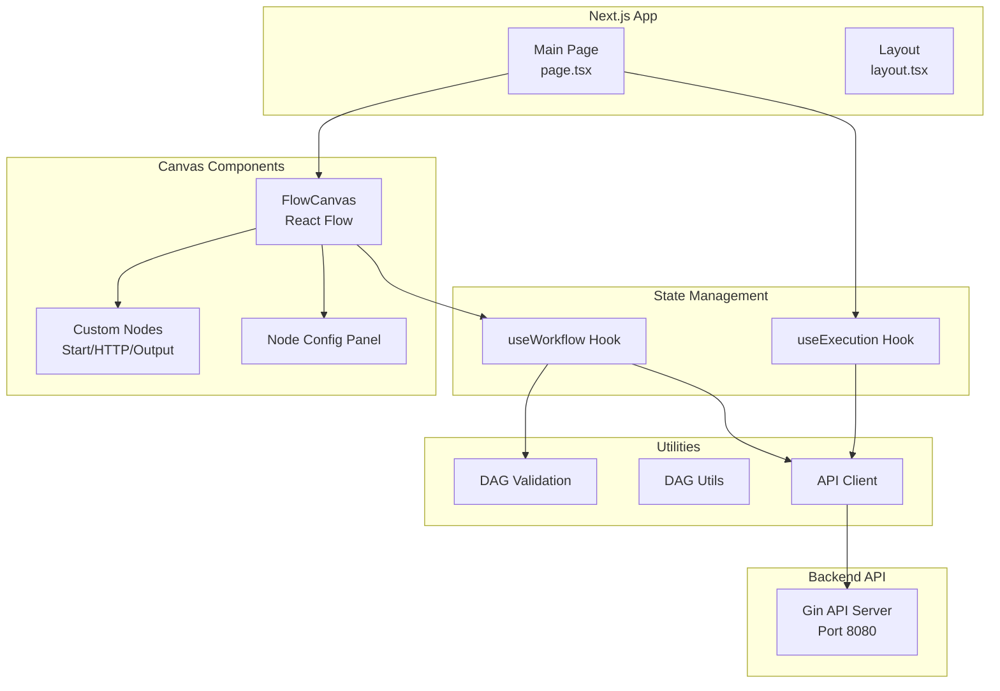
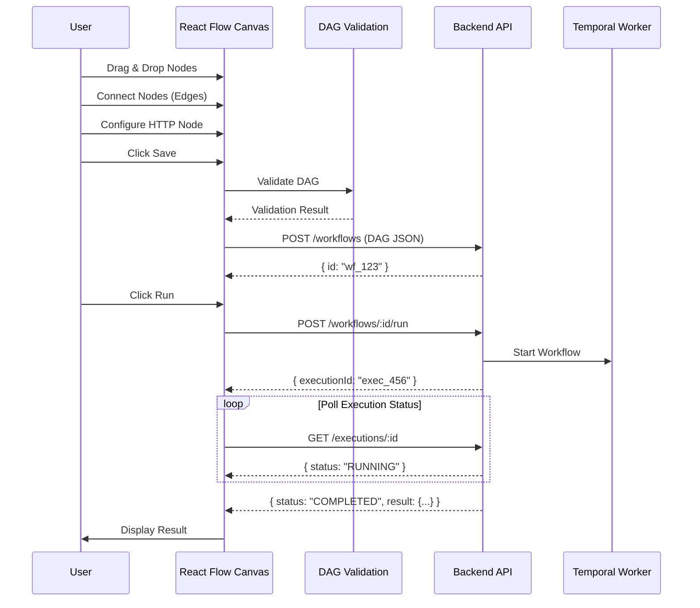
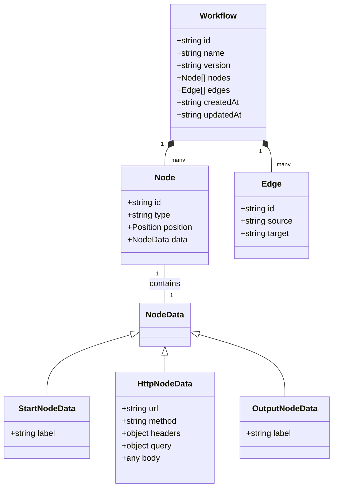

# Frontend Prompt Document (Next.js + React Flow)

## Overview
สร้าง frontend สำหรับ n8n-clone POC โดยใช้ **Next.js** สำหรับ framework และ **React Flow** สำหรับ visual workflow builder (DAG canvas)

---

## 1. Infrastructure Project Setup

### Prerequisites
- Node.js (LTS version)
- npm หรือ yarn หรือ pnpm

### Project Structure
```
frontend/
├── app/                    # Next.js App Router
│   ├── layout.tsx
│   ├── page.tsx           # Main canvas page
│   └── api/               # API routes (optional, ถ้าใช้ Next.js API routes)
├── components/
│   ├── canvas/
│   │   ├── FlowCanvas.tsx      # Main React Flow canvas
│   │   ├── CustomNodes.tsx     # Custom node components
│   │   │   ├── StartNode.tsx
│   │   │   ├── HttpNode.tsx
│   │   │   └── OutputNode.tsx
│   │   └── NodeConfigPanel.tsx # Node configuration panel
│   ├── ui/                # Reusable UI components
│   │   ├── Button.tsx
│   │   └── Modal.tsx
│   └── execution/
│       └── ExecutionResult.tsx # Display execution results
├── lib/
│   ├── dag/
│   │   ├── validation.ts  # DAG validation logic
│   │   └── utils.ts       # DAG utility functions
│   ├── api/
│   │   └── client.ts      # API client for backend
│   └── types/
│       └── dag.ts         # TypeScript types for DAG
├── hooks/
│   ├── useWorkflow.ts     # Workflow state management
│   └── useExecution.ts    # Execution state management
├── public/                # Static assets
├── package.json
├── tsconfig.json
└── next.config.js
```

### Initial Setup Commands
```bash
npx create-next-app@latest frontend --typescript --tailwind --app
cd frontend
npm install reactflow
npm install @types/node
```

---

## 2. Mermaid Diagrams

### Component Architecture


### User Flow Diagram


### DAG Data Structure


---

## 3. Task Breakdown with AI Prompts

### Task 1: Project Initialization & Dependencies
**Goal**: Setup Next.js project และ install dependencies

**AI Prompt**:
```
สร้าง Next.js project สำหรับ n8n-clone frontend:

1. ใช้ create-next-app with TypeScript และ Tailwind CSS
2. Install dependencies:
   - reactflow (สำหรับ workflow canvas)
   - axios หรือ fetch สำหรับ API calls
3. Setup project structure ตามที่กำหนด:
   - app/ directory สำหรับ Next.js App Router
   - components/ สำหรับ React components
   - lib/ สำหรับ utilities และ types
   - hooks/ สำหรับ custom hooks
4. Configure TypeScript และ Tailwind CSS
5. Setup basic layout และ page structure

ให้มี README.md พร้อม instructions สำหรับ development
```

---

### Task 2: TypeScript Types & DAG Schema
**Goal**: สร้าง TypeScript types สำหรับ DAG structure

**AI Prompt**:
```
สร้าง TypeScript types ใน lib/types/dag.ts:

1. Position interface: { x: number, y: number }
2. NodeData type (union type):
   - StartNodeData: { label?: string }
   - HttpNodeData: { url: string, method: string, headers?: object, query?: object, body?: any }
   - OutputNodeData: { label?: string }
3. Node interface:
   - id: string
   - type: 'start' | 'http' | 'output'
   - position: Position
   - data: NodeData
4. Edge interface:
   - id: string
   - source: string
   - target: string
5. Workflow interface:
   - id?: string
   - name: string
   - version: string
   - nodes: Node[]
   - edges: Edge[]
   - createdAt?: string
   - updatedAt?: string

ให้มี type guards และ helper functions สำหรับ type checking
```

---

### Task 3: DAG Validation Logic
**Goal**: สร้าง validation functions สำหรับ DAG

**AI Prompt**:
```
สร้าง DAG validation functions ใน lib/dag/validation.ts:

1. validateDAG(workflow: Workflow): { valid: boolean, errors: string[] }
   - ตรวจสอบ cycle (ใช้ DFS algorithm)
   - ตรวจสอบว่ามี start node อย่างน้อย 1 ตัว และไม่มี incoming edges
   - ตรวจสอบว่ามี output node อย่างน้อย 1 ตัว
   - ตรวจสอบ connectivity (start ต้องไปถึง output ได้)
   - ตรวจสอบ HTTP node config:
     - url ต้องไม่ว่าง
     - method default เป็น 'GET' ถ้าไม่ระบุ
     - method ต้องเป็น valid HTTP method

2. detectCycle(nodes: Node[], edges: Edge[]): boolean
   - ใช้ DFS เพื่อ detect cycle

3. hasPath(startNodeId: string, targetNodeId: string, edges: Edge[]): boolean
   - ตรวจสอบว่ามี path จาก start ไป target หรือไม่

4. validateNodeData(node: Node): string[]
   - Validate node data ตาม node type
   - Return array of error messages

ให้มี unit tests สำหรับทุก function
```

---

### Task 4: API Client
**Goal**: สร้าง API client สำหรับเรียก backend

**AI Prompt**:
```
สร้าง API client ใน lib/api/client.ts:

1. Base API configuration:
   - Base URL: process.env.NEXT_PUBLIC_API_URL || 'http://localhost:8080'
   - Setup axios instance หรือ fetch wrapper
   - Handle errors และ response parsing

2. Workflow API methods:
   - createWorkflow(workflow: Workflow): Promise<{ id: string }>
   - getWorkflow(id: string): Promise<Workflow>
   - updateWorkflow(id: string, workflow: Workflow): Promise<Workflow>

3. Execution API methods:
   - runWorkflow(workflowId: string): Promise<{ executionId: string }>
   - getExecution(executionId: string): Promise<Execution>
   - Execution type: { id, workflowId, status, result, error, startedAt, finishedAt }

4. Error handling:
   - Create custom error types
   - Handle network errors, 404, 500, etc.
   - Return meaningful error messages

ให้มี TypeScript types สำหรับ requests และ responses
```

---

### Task 5: Custom Node Components
**Goal**: สร้าง custom node components สำหรับ React Flow

**AI Prompt**:
```
สร้าง custom node components ใน components/canvas/CustomNodes.tsx:

1. StartNode component:
   - Visual: วงกลมหรือสี่เหลี่ยมสีเขียว
   - Label: "Start"
   - Handle: output handle ด้านขวา
   - ไม่มี config panel (หรือมีแค่ label editing)

2. HttpNode component:
   - Visual: สี่เหลี่ยมสีฟ้า
   - Label: แสดง method และ URL (truncated)
   - Handles: input handle ด้านซ้าย, output handle ด้านขวา
   - Config: method, url, headers, query, body (เมื่อ double-click หรือ click config button)

3. OutputNode component:
   - Visual: วงกลมหรือสี่เหลี่ยมสีส้ม
   - Label: "Output"
   - Handle: input handle ด้านซ้าย
   - แสดงผล execution result เมื่อมี

ใช้ React Flow's NodeProps และ Handle components
ให้มี styling ที่สวยงามและ responsive
```

---

### Task 6: React Flow Canvas Setup
**Goal**: สร้าง main canvas component ด้วย React Flow

**AI Prompt**:
```
สร้าง FlowCanvas component ใน components/canvas/FlowCanvas.tsx:

1. Setup React Flow:
   - ReactFlowProvider
   - nodes และ edges state
   - onNodesChange, onEdgesChange handlers
   - Background, Controls, MiniMap components

2. Node types configuration:
   - Register custom node types: 'start', 'http', 'output'
   - Map to CustomNode components

3. Features:
   - Drag & drop nodes จาก sidebar หรือ toolbar
   - Connect nodes (create edges)
   - Delete nodes และ edges (keyboard delete หรือ button)
   - Pan และ zoom
   - Node selection และ multi-selection

4. Toolbar/Sidebar:
   - Buttons สำหรับ add nodes (Start, HTTP, Output)
   - Save button
   - Run button
   - Clear button

5. State management:
   - ใช้ useState หรือ useReducer สำหรับ nodes และ edges
   - Sync กับ workflow state (useWorkflow hook)

ให้มี proper TypeScript types และ error handling
```

---

### Task 7: Node Configuration Panel
**Goal**: สร้าง panel สำหรับ configure node properties

**AI Prompt**:
```
สร้าง NodeConfigPanel component ใน components/canvas/NodeConfigPanel.tsx:

1. Panel behavior:
   - แสดงเมื่อเลือก node (selected node)
   - แสดง form ตาม node type

2. Start Node config:
   - Label input (optional)

3. HTTP Node config:
   - Method dropdown (GET, POST, PUT, DELETE, PATCH)
   - URL input (required, validate URL format)
   - Headers editor (key-value pairs, JSON format หรือ form)
   - Query params editor (key-value pairs)
   - Body editor (สำหรับ POST/PUT, JSON editor หรือ textarea)

4. Output Node config:
   - Label input (optional)
   - Display execution result (read-only, เมื่อมี result)

5. UI:
   - Modal หรือ side panel
   - Form validation
   - Save/Cancel buttons
   - Update node data เมื่อ save

ให้มี proper validation และ user-friendly interface
```

---

### Task 8: useWorkflow Hook
**Goal**: สร้าง custom hook สำหรับ workflow state management

**AI Prompt**:
```
สร้าง useWorkflow hook ใน hooks/useWorkflow.ts:

1. State:
   - workflow: Workflow | null
   - nodes: Node[]
   - edges: Edge[]
   - isLoading: boolean
   - error: string | null

2. Actions:
   - loadWorkflow(id: string): Promise<void>
     - Fetch workflow จาก API
     - Update nodes และ edges state
   - saveWorkflow(): Promise<string>
     - Validate DAG
     - Create หรือ update workflow ผ่าน API
     - Return workflow ID
   - addNode(type: 'start' | 'http' | 'output', position: Position): void
     - Generate unique node ID
     - Add node to nodes array
   - updateNode(id: string, data: Partial<Node>): void
     - Update node properties
   - deleteNode(id: string): void
     - Remove node และ connected edges
   - addEdge(source: string, target: string): void
     - Generate unique edge ID
     - Validate edge (prevent cycles)
     - Add edge to edges array
   - deleteEdge(id: string): void
     - Remove edge

3. Validation:
   - validate(): { valid: boolean, errors: string[] }
     - เรียกใช้ DAG validation functions

4. Reset:
   - reset(): void
     - Clear workflow state

ให้มี proper error handling และ loading states
```

---

### Task 9: useExecution Hook
**Goal**: สร้าง custom hook สำหรับ execution state management

**AI Prompt**:
```
สร้าง useExecution hook ใน hooks/useExecution.ts:

1. State:
   - executionId: string | null
   - execution: Execution | null
   - status: 'idle' | 'running' | 'completed' | 'failed'
   - result: any
   - error: string | null
   - isLoading: boolean

2. Actions:
   - runWorkflow(workflowId: string): Promise<void>
     - Call API POST /workflows/:id/run
     - Get executionId
     - Start polling execution status
   - pollExecution(executionId: string): Promise<void>
     - Poll GET /executions/:id ทุก 1-2 seconds
     - Update execution state
     - Stop polling เมื่อ status เป็น COMPLETED หรือ FAILED
   - clearExecution(): void
     - Reset execution state

3. Auto-polling:
   - ใช้ setInterval หรือ useEffect สำหรับ polling
   - Cleanup เมื่อ component unmount
   - Stop polling เมื่อ execution finished

4. Result display:
   - Format result สำหรับ display (JSON pretty print)
   - Handle error messages

ให้มี proper cleanup และ error handling
```

---

### Task 10: Main Page Integration
**Goal**: สร้าง main page ที่รวมทุก components

**AI Prompt**:
```
สร้าง main page ใน app/page.tsx:

1. Layout:
   - Header: Title "n8n-clone Workflow Builder"
   - Main area: FlowCanvas component
   - Sidebar (optional): Node palette, execution results
   - Footer: Status bar

2. Integration:
   - ใช้ useWorkflow hook สำหรับ workflow state
   - ใช้ useExecution hook สำหรับ execution state
   - Connect FlowCanvas กับ hooks
   - Handle Save button: validate และ save workflow
   - Handle Run button: run workflow และ poll status
   - Display validation errors
   - Display execution results

3. Features:
   - Toast notifications สำหรับ success/error messages
   - Loading indicators
   - Error boundaries

4. Styling:
   - ใช้ Tailwind CSS
   - Responsive design
   - Modern UI

ให้มี proper error handling และ user feedback
```

---

### Task 11: Execution Result Display
**Goal**: สร้าง component สำหรับแสดง execution results

**AI Prompt**:
```
สร้าง ExecutionResult component ใน components/execution/ExecutionResult.tsx:

1. Display execution information:
   - Execution ID
   - Status (with color coding: running=yellow, completed=green, failed=red)
   - Started at / Finished at timestamps
   - Duration

2. Display result:
   - Pretty print JSON result
   - Syntax highlighting (ใช้ library เช่น react-syntax-highlighter)
   - Collapsible sections (ถ้า result ซับซ้อน)
   - Copy to clipboard button

3. Display error:
   - Error message (ถ้า status = FAILED)
   - Error stack trace (ถ้ามี)

4. UI:
   - Modal หรือ expandable panel
   - Close button
   - Auto-scroll to result

ให้มี proper formatting และ user-friendly display
```

---

### Task 12: Styling & UI Polish
**Goal**: ปรับปรุง UI/UX และ styling

**AI Prompt**:
```
ปรับปรุง UI/UX สำหรับ frontend:

1. Styling improvements:
   - Consistent color scheme
   - Better node visuals (icons, gradients)
   - Smooth animations (node drag, edge creation)
   - Hover effects
   - Focus states

2. UX improvements:
   - Keyboard shortcuts (Delete, Ctrl+S, etc.)
   - Context menu (right-click on nodes)
   - Undo/Redo functionality (optional)
   - Auto-save draft (optional)
   - Better error messages
   - Loading states

3. Responsive design:
   - Mobile-friendly (ถ้าเป็นไปได้)
   - Tablet support
   - Different screen sizes

4. Accessibility:
   - ARIA labels
   - Keyboard navigation
   - Screen reader support

ใช้ Tailwind CSS และ modern CSS features
```

---

### Task 13: Integration Testing & Demo Flow
**Goal**: ทดสอบ end-to-end flow และ demo

**AI Prompt**:
```
สร้าง integration test หรือ manual testing checklist:

1. Test workflow creation:
   - Drag Start, HTTP, Output nodes
   - Connect nodes
   - Configure HTTP node (URL: https://jsonplaceholder.typicode.com/todos/1)
   - Click Save
   - Verify workflow saved successfully

2. Test workflow execution:
   - Click Run
   - Verify execution started
   - Poll execution status
   - Verify result displayed correctly

3. Test validation:
   - Try to create cycle (should show error)
   - Try to save without start node (should show error)
   - Try to save without output node (should show error)
   - Try to save HTTP node without URL (should show error)

4. Test error handling:
   - Invalid API URL
   - Network errors
   - Backend errors

ให้มี clear instructions และ expected results
```

---

## 4. Development Order Recommendation

1. **Task 1**: Project Initialization & Dependencies
2. **Task 2**: TypeScript Types & DAG Schema
3. **Task 3**: DAG Validation Logic
4. **Task 4**: API Client
5. **Task 5**: Custom Node Components
6. **Task 6**: React Flow Canvas Setup
7. **Task 7**: Node Configuration Panel
8. **Task 8**: useWorkflow Hook
9. **Task 9**: useExecution Hook
10. **Task 10**: Main Page Integration
11. **Task 11**: Execution Result Display
12. **Task 12**: Styling & UI Polish
13. **Task 13**: Integration Testing & Demo Flow

---

## 5. Key Dependencies

### npm Packages
- `next` - Next.js framework
- `react` & `react-dom` - React library
- `reactflow` - React Flow library สำหรับ canvas
- `axios` หรือ `fetch` - HTTP client
- `typescript` - TypeScript
- `tailwindcss` - CSS framework
- `react-syntax-highlighter` - Code syntax highlighting (optional)

### Environment Variables
- `NEXT_PUBLIC_API_URL` - Backend API URL (default: http://localhost:8080)

---

## 6. Notes

- ใช้ Next.js App Router (app directory)
- ใช้ TypeScript สำหรับ type safety
- ใช้ Tailwind CSS สำหรับ styling
- React Flow ต้องใช้ ReactFlowProvider wrapper
- Handle edge cases: empty canvas, invalid connections, network errors
- ใช้ proper state management (useState, useReducer, หรือ context ถ้าจำเป็น)
- Optimize re-renders (useMemo, useCallback)
- ใช้ proper error boundaries และ error handling

